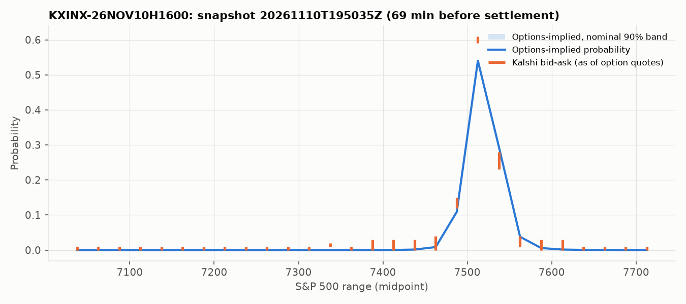
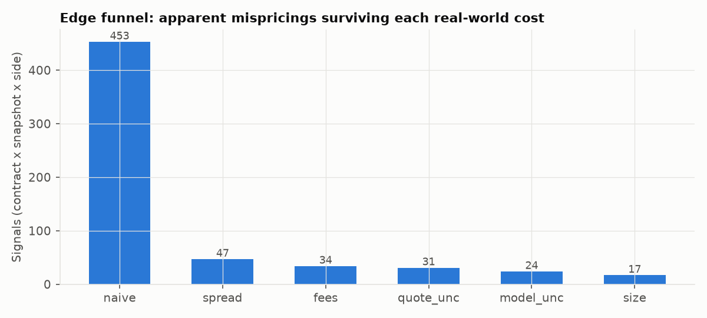

# Kalshi vs options: research report
_Generated 2026-11-10 20:31 UTC by `python -m kme report`. Every figure below is computed from files in `data/`; sections without enough data say so._

## Data coverage
- Panel rows: 1,140 (1,140 live, 0 backfill); rows without a synchronised Kalshi quote: 15
- Candle-replay check (candle state at fetch time == live book, live rows): 95.3% of 1,125 rows agree
- Snapshots: 25; events: 21; first decision 2026-10-09T19:44:21.670578+00:00, last 2026-11-10T20:05:58.397796+00:00
- Settled events with outcomes: 19
- Smile model chosen: {'spline': 24, 'svi': 1}

## Edge funnel
Stages are cumulative (see `src/kme/edge.py`). Kalshi prices are synchronised to the option chain's as-of time, so this measures mispricing; it is a tradeable backtest only with a real-time option feed. Model-error tolerance = 0.0021 (range contracts, same-day only). P&L is per contract after fees, t-stat clusters by event day, shown only with >= 40 settled event days.

| stage     |   signals |   contracts_distinct |   event_days |   settled_signals |   settled_days |   mean_pnl |   hit_rate |   daily_mean |   t_stat |
|:----------|----------:|---------------------:|-------------:|------------------:|---------------:|-----------:|-----------:|-------------:|---------:|
| naive     |       405 |                  232 |           21 |               377 |             19 |        nan |        nan |          nan |      nan |
| spread    |        45 |                   43 |           20 |                40 |             18 |        nan |        nan |          nan |      nan |
| fees      |        34 |                   34 |           18 |                31 |             17 |        nan |        nan |          nan |      nan |
| quote_unc |        31 |                   31 |           18 |                28 |             17 |        nan |        nan |          nan |      nan |
| model_unc |        24 |                   24 |           16 |                21 |             15 |        nan |        nan |          nan |      nan |
| size      |        17 |                   17 |           14 |                14 |             13 |        nan |        nan |          nan |      nan |

## Which forecast was better? (log score on the realised range)
```
{
  "n_events": 13,
  "note": "insufficient data (n=13, need >= 40 settled events)"
}
```

## Risk premium or mispricing? (pricing-kernel tilt)
- Snapshots with a full partition + density grid: 13
- theta_kalshi: insufficient data (n=13, need >= 40)
- theta_realized: {"n": 13, "note": "insufficient data (n=13, need >= 40)"}

## Figures




